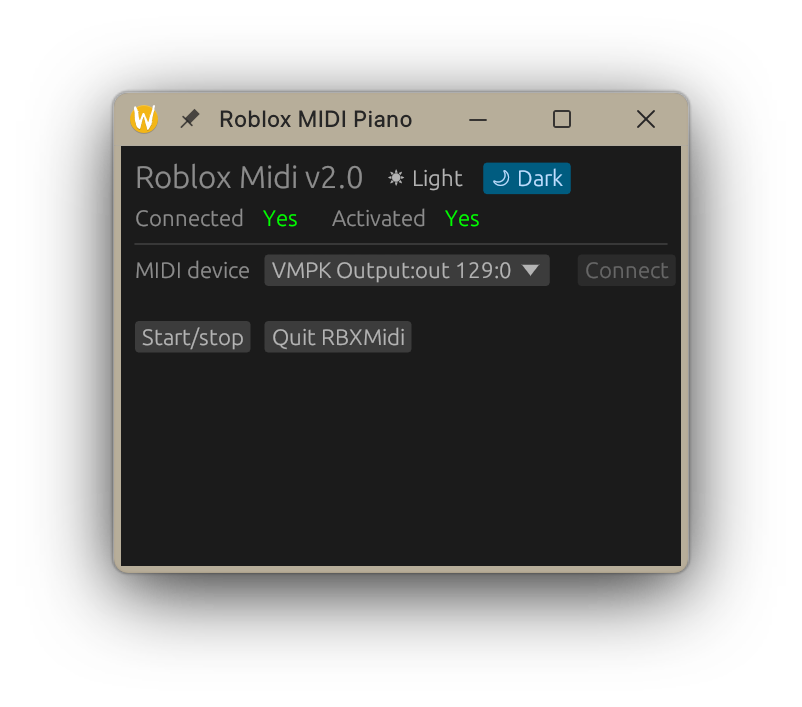
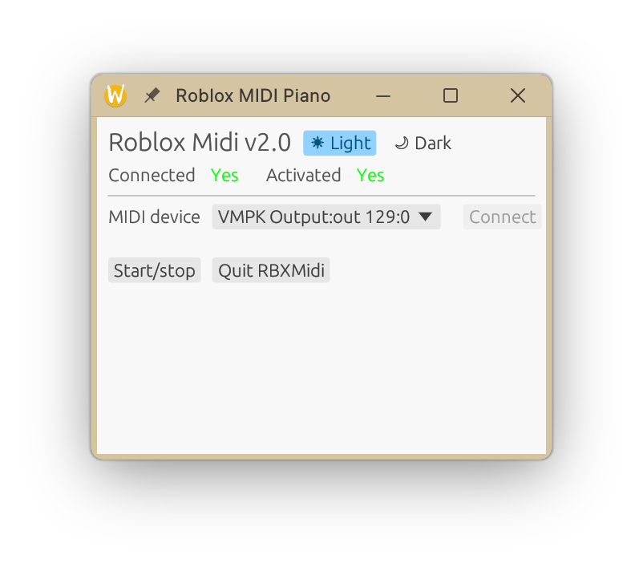

# 🎹 Roblox MIDI v2.0
Play Roblox pianos with your physical MIDI keyboard




## Installing
Simply clone this repo using
```
git clone https://github.com/Interfiber/rbxmidi.git
```
then run the following command to install:
```
# NOTE: Requires root password to install!
# Install directories: /usr/local/share/rbxmidi, /usr/local/bin/rbxmidi
sh install.sh
```
Now RBXMIDI is installed! You can find it in your applications list or run it from the terminal using ```rbxmidi```

## Platform status
* Linux (tested)
    * KDE + Wayland
    * Roblox running under Sober
* MacOS (untested)
* Windows (untested)